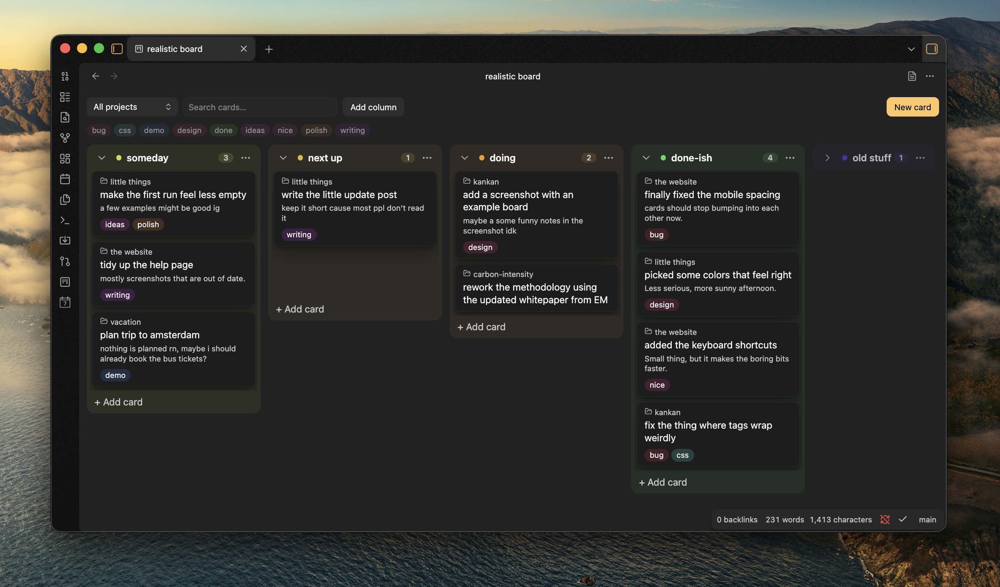

# Kankan

Simple kanban boards stored as plain markdown files.



- **Create new board** (command or ribbon icon) creates a board with Backlog, Todo, In progress, Done and Archive columns. Archive is collapsed by default.
- Drag cards between columns. Drag a column header to reorder columns.
- Select a card to edit its title, description, tags or column. Select a tag chip to filter by that tag.
- Double-click a column name to rename it. Use the **⋯** menu to add or delete columns.
- Any note with `kankan: board` in its frontmatter opens as a board. Use **Open as markdown** in the view header to edit the raw file.

## File format

```md
---
kankan: board
---

## Todo
- Fix login bug #work
  Users get logged out on refresh

## Archive %% collapsed %%
```

## Development

`npm install`, then `npm run dev`. Parser check: `npx esbuild src/board.check.ts --bundle --platform=node | node`.
